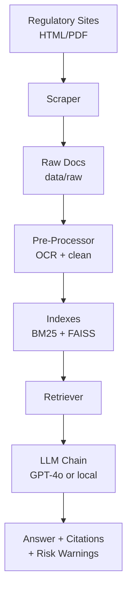

# Financial RAG System – Your Personal Investment Companion

**Empowering First-Time Investors in India**

An intelligent investment guidance system built specifically for individuals beginning their journey in the Indian stock market. If you're hesitant about opening your first demat account, overwhelmed by financial jargon, or simply need clear explanations of market regulations, this AI assistant is here to provide reliable, easy-to-understand guidance.

**Why we built this:**
We noticed that many aspiring investors stay away from the stock market because of information overload and fear of making costly mistakes. This system was created to bridge that gap by transforming complex regulatory documents from SEBI, RBI, BSE, NSE, and other trusted sources into practical, actionable advice that actually makes sense for beginners.

**What it helps you with:**
- **Getting Started**: Complete guidance for demat account setup, KYC procedures, and making your first trades
- **Understanding the Rules**: Simplified explanations of SEBI guidelines, RBI policies, and market regulations
- **Staying Safe**: Learn about potential pitfalls and how to avoid common investment mistakes  
- **Investing Confidently**: Ensure your decisions align with current regulations and best practices
- **Growing Your Knowledge**: Build financial literacy through information from official, trusted sources


---

## 🌟 Key Features

| Category | Highlights |
|----------|------------|
| **Corpus** | SEBI, RBI, MCA, BSE, NSE, IRDAI, PFRDA, DPIIT, IndiaCode |
| **Scraper** | Custom User-Agent, retry/back-off, 404 handling, optional Selenium fallback, sitemap discovery |
| **Parsing** | PDFMiner for digital PDFs; Tesseract OCR for scanned documents |
| **Retrieval** | Hybrid BM25 lexical + FAISS dense embeddings (default: `BAAI/bge-base-en` or OpenAI `text-embedding-3-small`) |
| **LLM Layer** | GPT-4o API by default; optional local 7-13B GGUF via Ollama |
| **Interfaces** | Gradio web UI, CLI test harness, FastAPI endpoint |
| **Deployment** | Docker Compose (FastAPI + Redis) |
| **Persistence** | All artifacts stored in `data/` (keeps state on Google Drive when running in Colab) |

---

## 🏗️ System Architecture



---

## 📋 Prerequisites

- Python 3.10 or later (or Google Colab)
- OpenAI API key or local GGUF / LoRA weights
- (Colab) Google Drive mounted at `/content/drive`

---

## 🚀 Quick Start (Colab)

```python
# Mount Drive
from google.colab import drive
drive.mount('/content/drive')

# Clone repository
%cd /content/drive/MyDrive
!git clone https://github.com/<your-handle>/RAG_fin_iter1.git
%cd RAG_fin_iter1

# Install dependencies
!pip install -q -r requirements.txt

# Set API key
import os
os.environ["OPENAI_API_KEY"] = "<your-key>"

# Crawl, process, index (fast demo)
!python scrape_and_process.py --fast

# Launch Gradio chat UI
!python app.py
```

---

## 💻 Local Installation

```bash
git clone https://github.com/<your-handle>/RAG_fin_iter1.git
cd RAG_fin_iter1
python -m venv .venv
source .venv/bin/activate          # Windows: .venv\Scripts\activate
pip install -r requirements.txt
export OPENAI_API_KEY="<your-key>"
python scrape_and_process.py --source sebi rbi mca
python app.py                      # opens http://127.0.0.1:7860
```

---

## 📁 Project Structure

```
RAG_fin_iter1/
├── .env / .env.example           # secrets and overrides
├── config/
│   └── api_key.txt
├── data/
│   ├── cache/
│   ├── faiss_index/              # index.faiss, index.pkl, metadata.json
│   ├── processed/
│   └── raw/
│       └── bse/ dpiit/ indiacode/ irdai/ mca/ nse/ pfrda/ rbi/ sebi/
├── logs/
│   └── rag_log_YYYYMMDD.log
├── src/
│   ├── fetch/                    # download_bulk.py, selenium_fallback.py
│   ├── utils/                    # downloader.py, scrape_helpers.py
│   ├── compliance.py
│   ├── crawl_all_regulations.py
│   ├── ingest_documents.py
│   ├── rag_chain.py
│   └── text_splitter.py
├── app.py                        # Gradio entry point
├── data_processor.py             # build / refresh index
├── scrape_and_process.py         # crawl + preprocess wrapper
├── scrape_pdf.py                 # PDF -> text pipeline
├── test_system.py                # health-check
└── requirements.txt
```

---

## ⚙️ Configuration

```bash
cp .env.example .env                  # add your keys
cp configs/config.sample.yaml configs/config.yaml
```

### Key settings (configs/config.yaml)

| Section | Field | Example |
|---------|-------|---------|
| **SCRAPER** | `user_agent` | `Mozilla/5.0 (Macintosh ...)` |
| | `max_attempts` | `5` |
| | `use_selenium` | `true` |
| **INDEXING** | `embedding_model` | `openai` / `BAAI/bge-base-en` |
| | `chunk_size` | `800` |
| **RAG** | `top_k` | `4` |
| | `llm_model` | `gpt-4o` |

---

## 🔄 Typical Workflow

```bash
# 1. Crawl and preprocess new documents
python scrape_and_process.py --source sebi rbi mca --max-workers 8

# 2. Build / refresh the vector index
python data_processor.py --refresh-index

# 3. Launch chat UI
python app.py

# Optional: run an API server
# uvicorn src.rag_chain:app --host 0.0.0.0 --port 8000
```

---

## 🧪 Testing

```bash
python test_system.py   # verifies paths, keys, index presence
```

Add retrieval accuracy tests under `tests/` and execute with `pytest`.

---

## 🔧 Troubleshooting

| Problem | Remedy |
|---------|--------|
| **No vector store found** | `python data_processor.py --refresh-index` |
| **OpenAI key error** | `export OPENAI_API_KEY=<key>` (or set in `.env`) |
| **Scraper gets 403 or CAPTCHA** | Set `use_selenium: true` in config and retry; rotate User-Agent |
| **Other errors** | Check `logs/` and run `test_system.py` |

---

## 🔗 Reference Links

- [SEBI](https://www.sebi.gov.in)
- [RBI](https://www.rbi.org.in)
- [MCA](https://www.mca.gov.in)
- [NSE India](https://www.nseindia.com)
- [BSE India](https://www.bseindia.com)

---

## ⚠️ Disclaimer

This project is for educational purposes only and does not constitute financial or legal advice. Consult a SEBI-registered advisor for personalized guidance.

---

## 📄 License

MIT – see [LICENSE](LICENSE).

---

**Made with ❤️ for the Indian investor community.**